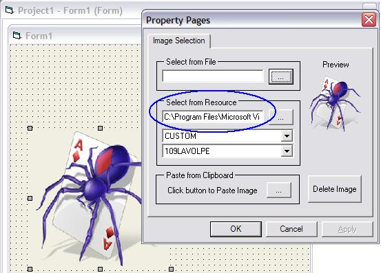



## FYI: UserControls Accessing RES Files \(Follow Up\)

### Description

The intent is to show a way usercontrols (compiled or not) can access their host's RES files, compiled or not. This project contains the main class which reads from compiled &amp; uncompiled project's RES files. The usercontrol has a property page that displays RES file images during design time -- kinda niffty. Please don't ask for updates to the usercontrol, it is only a test project for the cResReader class. For you UC lovers, take this and run -- if you need some advice on this technique, ask away, I'm already about 2 months ahead of you I think.
 
### More Info
 

             |
---                |---
**Submitted On**   |2007-01-05 19:21:46
**By**             |[LaVolpe](https://github.com/Planet-Source-Code/PSCIndex/blob/master/ByAuthor/lavolpe.md)
**Level**          |Intermediate
**User Rating**    |5.0 (60 globes from 12 users)
**Compatibility**  |VB 6\.0
**Category**       |[Custom Controls/ Forms/  Menus](https://github.com/Planet-Source-Code/PSCIndex/blob/master/ByCategory/custom-controls-forms-menus__1-4.md)
**World**          |[Visual Basic](https://github.com/Planet-Source-Code/PSCIndex/blob/master/ByWorld/visual-basic.md)
**Archive File**   |[FYI\_\_UserC204114152007\.zip](https://github.com/Planet-Source-Code/lavolpe-fyi-usercontrols-accessing-res-files-follow-up__1-67565/archive/master.zip)

